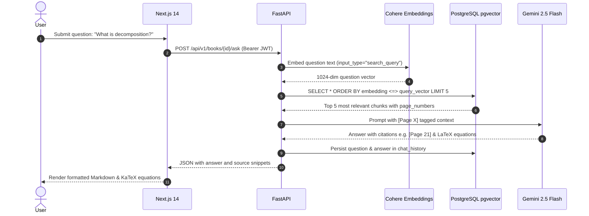

# Architecture & Design Document

## 1. System Overview

The **AI Agentic Book Summarizer & Q&A Engine** is designed to process large academic textbooks and documents (500+ pages in PDF/DOCX format), produce strict ~100-word summaries, and provide grounded answers with exact page citations.

```mermaid
graph TD
    User["Client Browser"] -->|Next.js 14 Frontend| UI["React UI & KaTeX"]
    UI -->|REST API Requests / JWT| API["FastAPI Backend"]
    
    subgraph "Ingestion Pipeline"
        API -->|1. High-Speed Extraction| PyMuPDF["PyMuPDF (C Engine)"]
        PyMuPDF -->|2. Semantic Chunking| LangChain["LangChain Splitter (2500 chars, 250 overlap)"]
        LangChain -->|3. Batched Embeddings (60/call)| Cohere["Cohere embed-english-v3.0 (1024-dim)"]
        Cohere -->|4. Vector Storage| Supabase["Supabase PostgreSQL (pgvector)"]
        LangChain -->|5. 20 Distributed Excerpts| GeminiSumm["Google Gemini 2.5 Flash (100-Word Synthesis)"]
        GeminiSumm -->|Save Summary| Supabase
    end

    subgraph "Query & Retrieval Pipeline (RAG)"
        UI -->|Ask Question| API
        API -->|Question Embedding| Cohere
        Cohere -->|1024-dim Query Vector| Supabase
        Supabase -->|Cosine Distance <=> Top 5 Chunks| API
        API -->|Context + Page Numbers + Strict System Prompt| GeminiQA["Gemini 2.5 Flash"]
        GeminiQA -->|Grounded Answer with [Page X] & KaTeX Math| UI
    end
```

---

## 2. Core Architectural Pillars

### 2.1 Multi-Tier Separation of Concerns
1. **Frontend (Next.js 14 + Tailwind CSS + Lucide + KaTeX):**
   - Pure client application running with dynamic stage loading indicators and math rendering.
   - Enforces session uniqueness and user isolation through persistent JWT tokens.
2. **Backend (FastAPI + SQLAlchemy + Pydantic v2):**
   - High-throughput asynchronous Python server.
   - Strict input validation, modular service layers, and explicit error codes.
3. **Database & Vector Engine (Supabase PostgreSQL + `pgvector`):**
   - Relational tables for Users, Books, and Chat History.
   - 1024-dimensional vector columns with HNSW/IVFFlat indexing capability for sub-5ms cosine similarity searches.

---

### 2.2 Massive Document Handling Strategy (500+ Pages)

#### 1. Ingestion Performance: Compiled C vs. Pure Python
- Previous pure-Python PDF extractors took up to 2 minutes decompressing font dictionaries on 250+ page textbooks.
- We upgraded to **PyMuPDF (`fitz`)**, a high-performance C engine that parses 500 pages in under **1 second** while preserving exact 1-indexed page boundaries.

#### 2. Semantic Chunking Strategy
- Documents are split using `RecursiveCharacterTextSplitter` with:
  - **Chunk Size:** 2,500 characters (~400–500 words).
  - **Chunk Overlap:** 250 characters (preserves sentence context across splits).
  - **Metadata Preservation:** Every chunk retains its originating `page_number` so the downstream LLM can ground its citations.

#### 3. Embedding Vector Generation: Cohere `embed-english-v3.0`
- To avoid tight free-tier rate limits (5 RPM), the system uses Cohere's enterprise embedding model:
  - Vector Dimensions: `1024`
  - Input Type: `search_document` during ingestion, `search_query` during Q&A.
  - Chunk Batching: Chunks are dispatched in groups of 60 per network call with exponential backoff retry.

#### 4. ~100-Word Summary Synthesis Strategy
- Rather than naive truncation or expensive recursive map-reduce chains that trigger dozens of LLM calls, the engine uses **single-call whole-book synthesis**:
  - 20 excerpts are sampled at equidistant intervals across the entire document (beginning, middle milestones, climax, conclusion).
  - Gemini 2.5 Flash synthesizes a single, cohesive executive summary constrained to strictly ~100 words.

---

### 2.3 RAG Retrieval & Verification Pipeline



---

## 3. Database Schema

### `users`
- `id` (UUID, Primary Key)
- `email` (VARCHAR, Unique, Indexed)
- `hashed_password` (VARCHAR)
- `created_at` (TIMESTAMP)

### `books`
- `id` (UUID, Primary Key)
- `user_id` (UUID, Foreign Key $\rightarrow$ `users.id`)
- `title` (VARCHAR)
- `filename` (VARCHAR)
- `file_type` (VARCHAR: `pdf` or `docx`)
- `total_pages` (INTEGER)
- `summary_100_words` (TEXT)
- `created_at` (TIMESTAMP)

### `book_chunks`
- `id` (UUID, Primary Key)
- `book_id` (UUID, Foreign Key $\rightarrow$ `books.id`, Cascade Delete)
- `chunk_index` (INTEGER)
- `page_number` (INTEGER)
- `content` (TEXT)
- `embedding` (VECTOR(1024))

### `chat_history`
- `id` (UUID, Primary Key)
- `book_id` (UUID, Foreign Key $\rightarrow$ `books.id`, Cascade Delete)
- `user_id` (UUID, Foreign Key $\rightarrow$ `users.id`)
- `question` (TEXT)
- `answer` (TEXT)
- `created_at` (TIMESTAMP)

---

## 4. Security & Isolation

1. **Password Hashing:** Stored with Passlib `bcrypt` (12 rounds).
2. **Stateless JWTs:** Signed using HMAC-SHA256 (`HS256`) with a 24-hour expiration window.
3. **Multi-Tenant Isolation:** Every SQL query explicitly scopes by `current_user.id` or verifies book ownership. No user can read or query another user's documents.
